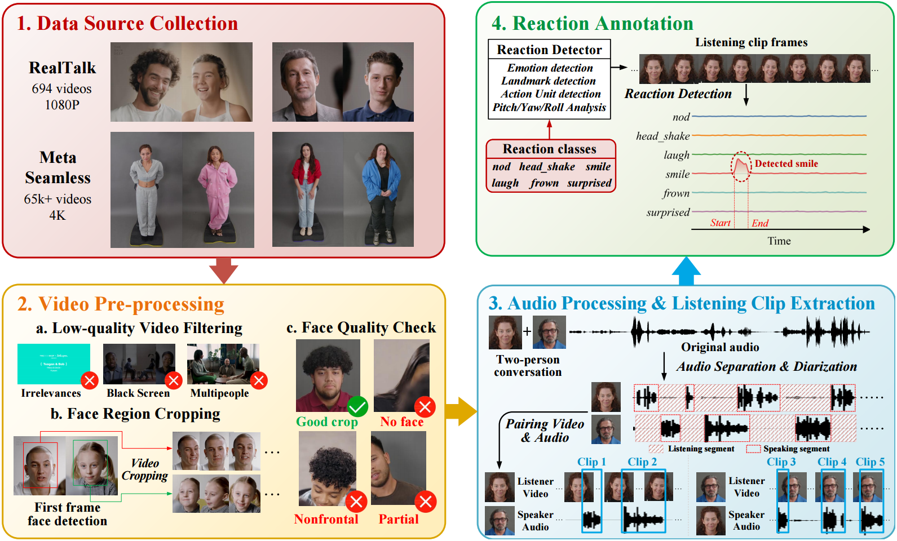

# Visual Reaction Annotation for GLARE

**Visual reaction detection and speaker-prosody extraction for _GLARE: Generating Listening Heads with Appropriate Reactions_.**

This repository provides the annotation-side processing tools for GLARE. Starting from prepared listener portrait videos, it extracts facial emotion scores and MediaPipe face features, computes six types of visual listener reactions, and exports frame-wise reaction intensities. It also includes an optional Qwen2-Audio pipeline for extracting **speaker-side prosodic fluctuations** and adding them to an existing training HDF5 file.

## Pipeline

The workflow retains the six stages used in the original repository documentation:

```text
Prepared listener portrait videos
    |
    +-- 1. FER emotion extraction --------------------> emotion CSVs
    |
    +-- 2. MediaPipe face-feature extraction ----------> face-feature PKLs
                    |
             3. Completeness checks + usable manifest
                    |
             4. Six visual reaction detectors
                    |
                Per-reaction CSVs
                    |
                combine_reactions.py
                    |
                Six-channel reaction CSVs
                    |
             5. Reaction HDF5 injection + pruning
                    |
                    +-----------------------------------------------+
                                                                    |
Aligned SPEAKER audio --> 6. Qwen2-Audio prosody extraction           |
                              |                                     |
                         Chunk event TXT --> intensity CSV ---------+
                                                                    |
                                                Final training HDF5
                                                /reaction + /intensity
```

The raw-video filtering, portrait cropping, source separation, diarization, and speaker–listener pairing described in the paper must be completed upstream. Manual event verification and the final reaction-metric evaluation protocol are separate from the automatic pipeline above.

The following is the workflow from the paper.



## Repository structure

```text
.
├── README.md
├── Current_folder_README.md          # Manifest and reaction-HDF5 utilities
├── generate_usable.py                # Usable-list construction; path adaptation required
├── build_reaction_pruned_h5.py       # Inject /reaction and prune copied HDF5
├── txt_process.py                   # Local list-inspection/path-rewriting helper
├── fer_emotion/
│   ├── README.md
│   ├── detect_multi_gpu.py          # Batch FER extraction
│   └── examine_output.py            # CSV/video frame-count checks
├── nod_headshake/
│   ├── face_detection/
│   │   ├── README.md
│   │   ├── detect_face_multithread.py
│   │   ├── examine_output.py
│   │   └── face_landmarker_v2_with_blendshapes.task
│   └── old/                         # Legacy py-feat extractors
├── reaction_detector/
│   ├── README.md
│   ├── smiling/
│   ├── laughing/
│   ├── frowning/
│   ├── surprised/
│   ├── nodding/                     # Original and v2 implementations
│   ├── head_shaking/
│   ├── combine_reactions.py
│   ├── sample_reaction_videos.py
│   └── fix_truncated_seamless_filenames.py
└── prosody_extract/
    ├── README.md
    ├── requirements.txt
    ├── input_prompt.txt
    ├── batch_emotion_fluctuation.py
    ├── batch_emotion_fluctuation_multi_gpu.py
    └── build_qwen_intensity_h5.py
```

Additional launchers and inspection utilities are documented in the corresponding subdirectory READMEs.

## Installation

Use **Python 3.10 or later** for the current Python type annotations. The commands below are dependency starting points; the repository does not supply a pinned, tested environment for the entire pipeline.

### Visual processing

From the repository root, install the main packages:

```bash
python -m pip install numpy pandas tqdm opencv-python mediapipe h5py fer
```

FER GPU processing additionally needs a TensorFlow/CUDA/cuDNN combination compatible with the selected FER installation. MediaPipe extraction in `detect_face_multithread.py` uses CPU worker threads. The downstream reaction rules and HDF5 utilities do not require GPU inference.

The MediaPipe `.task` asset is present under `nod_headshake/face_detection/`; its location can be changed with `--model_path`.

### Optional prosody processing

Install PyTorch appropriate for the GPU environment, then install the prosody dependencies:

```bash
python -m pip install -r prosody_extract/requirements.txt h5py
```

A local **Qwen2-Audio-7B-Instruct** checkpoint is required. It is not bundled with this repository. Set `--model-path` to that checkpoint and use a compatible Transformers version providing `Qwen2AudioForConditionalGeneration`.

## Usage

Run the following commands from the repository root. They demonstrate a **RealTalk-style prepared dataset layout**. Paths are local examples, not download locations.

```bash
DATASET=realtalk
VIDEO_ROOT=/path/to/RealTalkListening/Original
AUDIO_ROOT=/path/to/RealTalkListening/Original_wav
WORK_ROOT="$PWD/outputs/$DATASET"
REACTION_ROOT="$WORK_ROOT/reactions"
USABLE_TXT="$WORK_ROOT/usable_${DATASET}.txt"
BASE_H5=/path/to/preprocessed_listening.h5
QWEN_MODEL=/path/to/qwen2-audio-7b-instruct

mkdir -p "$WORK_ROOT"
```

Inputs should already contain a stable listener portrait, with aligned **speaker** audio available for the optional prosody stage. The paper uses 25 FPS video and 16 kHz audio. The visual extractors do not convert input videos to 25 FPS; temporal windows in the reaction rules are measured in frames.

For Seamless, use `DATASET=seamless` and the corresponding prepared video/audio roots. Check the dataset-specific path rules in Steps 3 and 6 before running. Changing only the dataset variable does not repair all historical path assumptions.

### 1. Extract frame-wise facial emotion scores

```bash
python fer_emotion/detect_multi_gpu.py \
  --input-root "$VIDEO_ROOT" \
  --output-root "$WORK_ROOT/fer" \
  --dataset-name RealTalkListening \
  --gpus "0" \
  --workers-per-gpu 1 \
  --batch-size 64 \
  --mtcnn
```

Use `--gpus "0,1"` for multiple GPUs. Start with `--max-videos 2` to check FER compatibility and output columns. Existing CSVs are skipped unless `--force` is supplied.

The explicit CSV writer uses the **immediate parent directory name**, rather than the full input-relative hierarchy:

```text
Input:  <VIDEO_ROOT>/<conversation_id>/<clip_id>.mp4
Output: <WORK_ROOT>/fer/<conversation_id>/emo_scores/<clip_id>.csv
```

Deeply nested datasets therefore need a naming/collision check. See [FER documentation](fer_emotion/README.md).

### 2. Extract landmarks, blendshapes, and head pose

```bash
python nod_headshake/face_detection/detect_face_multithread.py \
  --input_dir "$VIDEO_ROOT" \
  --output_dir "$WORK_ROOT/face" \
  --model_path nod_headshake/face_detection/face_landmarker_v2_with_blendshapes.task \
  --num_workers 4 \
  --skip_existing
```

This creates one PKL per video, preserving paths relative to `VIDEO_ROOT`. Each decoded frame has a dictionary containing face-detection status, landmarks, bounding boxes, blendshapes, an AU04 proxy, and pitch/roll/yaw in degrees.

`au04_proxy` is the average of `browDownLeft` and `browDownRight`. It is **not an independently estimated FACS AU04 measurement**. The `old/` directory contains legacy py-feat extractors and is not part of this MediaPipe workflow.

See [face-feature documentation](nod_headshake/face_detection/README.md).

### 3. Check completeness and prepare the usable manifest

Check face-feature frame counts against the videos:

```bash
python nod_headshake/face_detection/examine_output.py \
  --video_root "$VIDEO_ROOT" \
  --pkl_root "$WORK_ROOT/face" \
  --output_txt "$WORK_ROOT/alignment_report.txt" \
  --num_workers 8
```

The report contains `video_path`, `pkl_total_frames`, `video_total_frames`, `detection_rate`, and `frame_count_match`. The current writer omits failed/partially detected samples, but it can retain a row with `frame_count_match=False`; inspect that field separately.

For FER completeness checking, first edit `ORIGINAL_DIR`, `OUTPUT_DIR`, and `RESULT_FILE` in `fer_emotion/examine_output.py` to match the current inputs and outputs, then run:

```bash
python fer_emotion/examine_output.py
```

The downstream detectors expect a **headerless** manifest with one sample per line:

```text
/abs/videos/conversation_a/clip_001.mp4,/abs/work/fer/conversation_a/emo_scores/clip_001.csv,/abs/work/face/conversation_a/clip_001.pkl
```

The three fields are `video_path,fer_csv_path,face_analysis_pkl_path`. Use actual paths and avoid commas in filenames.

After those adaptations, the existing helper can be called as follows:

```bash
python generate_usable.py \
  --alignment_report "$WORK_ROOT/alignment_report.txt" \
  --incomplete_list "$WORK_ROOT/incomplete_videos.txt" \
  --output_txt "$USABLE_TXT"
```

Alternatively, supply an already validated three-column manifest at `USABLE_TXT` and continue below. Do not treat an unmodified run of this helper as proof that all modalities are complete and aligned.

See [manifest and HDF5 utilities](Current_folder_README.md).

### 4. Detect and combine the six visual reactions

Run the expression detectors and head-shaking detector:

```bash
for reaction in smiling laughing frowning surprised head_shaking; do
  python "reaction_detector/${reaction}/run_${reaction}_intensity_mt.py" \
    --usable_txt "$USABLE_TXT" \
    --original_root "$VIDEO_ROOT" \
    --output_dir "$REACTION_ROOT/$reaction/output_$DATASET" \
    --render_overlay_video_output_dir "$WORK_ROOT/overlays/$reaction" \
    --num_workers 8
done
```

Run the v2 nodding detector:

```bash
python reaction_detector/nodding/run_nodding_intensity_mt_v2.py \
  --usable_txt "$USABLE_TXT" \
  --original_root "$VIDEO_ROOT" \
  --output_dir "$REACTION_ROOT/nodding/output_$DATASET" \
  --render_overlay_video_output_dir "$WORK_ROOT/overlays/nodding" \
  --num_workers 8
```

For a small inspection run, append `--validate --validate_n 20 --validate_seed 42`; validation mode also renders overlays. Use `--render_overlay_video` to render overlays for a full run. Read the per-detector logs and failure counts before combining outputs.

#### Current Python defaults

**Note that parameters in each script may be modified for better performance.**

| Detector | Smoothing window, frames | `th_on` | `th_off` | Minimum event length, frames |
|---|---:|---:|---:|---:|
| Smiling | 7 | 0.45 | 0.30 | 6 |
| Laughing | 9 | 0.52 | 0.36 | 8 |
| Frowning | 7 | 0.42 | 0.30 | 6 |
| Surprised | 7 | 0.45 | 0.32 | 5 |
| Nodding v2 | 9 | 0.58 | 0.42 | 10 |
| Head shaking | 9 | 0.50 | 0.35 | 7 |

The motion detectors additionally apply amplitude, direction-change, and velocity constraints. Their velocity signals are frame-to-frame angle differences. See [nodding parameter guidance](reaction_detector/nodding/README_nodding_params.md), but use the Python entry point: the supplied v2 shell launcher has a commented line interrupting a continued command and does not forward arbitrary `"$@"` arguments.

#### Combine per-reaction outputs

```bash
python reaction_detector/combine_reactions.py \
  --usable_txt "$USABLE_TXT" \
  --reaction_root "$REACTION_ROOT" \
  --original_root "$VIDEO_ROOT" \
  --dataset_name "$DATASET" \
  --output_dir "$WORK_ROOT/combined" \
  --num_workers 8
```

The combiner reads exactly:

```text
<REACTION_ROOT>/<reaction>/output_<dataset>/<video-relative-path>.csv
```

An output directory named only `output/` will not match this lookup. A clip is not combined if any of its six reaction CSVs is missing; check the reported failures. For each frame, the combiner retains the **largest positive intensity** and sets the other five channels to zero. All-zero input remains all zero. Ties follow the channel order listed under [Output formats](#output-formats). This is **frame-wise winner selection**, not event-level overlap resolution by average confidence.

#### Inspect reaction examples

```bash
python reaction_detector/sample_reaction_videos.py \
  --reaction smiling \
  --number 20 \
  --usable_txt "$USABLE_TXT" \
  --reaction_detector_root "$REACTION_ROOT" \
  --original_root "$VIDEO_ROOT" \
  --output_subdirs "output_$DATASET"
```

This samples clips with sufficiently strong detected evidence and writes single-class overlay videos and `selected_samples.csv` under the reaction's `reaction_sample/` directory.

### 5. Inject reactions into an existing HDF5 file

```bash
python build_reaction_pruned_h5.py \
  --dataset_name "$DATASET" \
  --input_h5 "$BASE_H5" \
  --output_h5 "$WORK_ROOT/listening_reaction_pruned.h5" \
  --combined_root "$WORK_ROOT/combined" \
  --reaction_group_name reaction \
  --anchor_group_name audio \
  --chunk_size 60
```

The script copies the input file, writes `/reaction/<clip_key>/chunk_###`, and prunes other top-level modality groups in the **copy** to the available reaction clip/chunk keys. Reaction chunks have shape `(60, 6)` and dtype `float16` with the default settings. The default anchor alignment limits the reaction chunk count using `/audio`. Verify that `/audio` exists, that chunk names are contiguous from `chunk_000`, and that all modalities use the same time origin.

### 6. Extract speaker prosody and inject `/intensity` — optional

This stage analyzes the **speaker's aligned audio**. The prompt in [`prosody_extract/input_prompt.txt`](prosody_extract/input_prompt.txt) requests localized acoustic/prosodic fluctuations rather than semantic interpretation.

```bash
python prosody_extract/batch_emotion_fluctuation_multi_gpu.py \
  --dataset-name "$DATASET" \
  --list-file "$USABLE_TXT" \
  --input-root "$AUDIO_ROOT" \
  --output-root "$WORK_ROOT/prosody_txt" \
  --model-path "$QWEN_MODEL" \
  --prompt-file prosody_extract/input_prompt.txt \
  --sample-rate 16000 \
  --chunk-seconds 2.4 \
  --gpu-ids "0" \
  --num-workers 1 \
  --batch-size 12 \
  --skip-existing
```

Use `--gpu-ids "0,1" --num-workers 2` for two workers. Start with `--max-audios 2` to validate audio lookup and model loading. Optional loudness normalization and low-RMS gating are disabled unless explicitly enabled.

The scripts read the first manifest column and rewrite it to an audio path:

| Dataset | Multi-GPU script's rewrite |
|---|---|
| `realtalk` | `Original` → `Original_wav`; `mp4` → `wav`. |
| `seamless` | `Seamless` → `Seamless_audio`; `.mp4` → `_speak.wav`. |

Only full audio chunks are processed. Each chunk produces a `chunk_###.txt` containing chunk-local intervals in seconds:

```text
0.40, 1.20, 0.78
1.60, 2.10, 0.91
```

These numbers illustrate the format. `NULL` represents no accepted interval in a processed chunk; it is distinct from a missing file caused by failure. The multi-GPU parser discards malformed, out-of-range, or below-0.5 intervals. The prompt asks for non-overlap, but the parser does not enforce event merging or non-overlap itself.

Convert the outputs and inject prosody into a new HDF5 copy:

```bash
python prosody_extract/build_qwen_intensity_h5.py \
  --dataset_name "$DATASET" \
  --txt_root "$WORK_ROOT/prosody_txt" \
  --converted_root "$WORK_ROOT/prosody_csv" \
  --input_h5 "$WORK_ROOT/listening_reaction_pruned.h5" \
  --output_h5 "$WORK_ROOT/listening_reaction_prosody.h5" \
  --intensity_group_name intensity \
  --anchor_group_name audio \
  --chunk_size 60 \
  --fps 25
```

Keep `chunk_seconds × fps = chunk_size`, with a shared starting timestamp across modalities. Each `/intensity/<clip_key>/chunk_###` is a `float16` array of shape `(60,)`; the learned projection to a prosody embedding belongs to the GLARE model, not this exporter. The converter fills frame slices using `floor(start × fps)` through `ceil(end × fps) - 1`. Later overlapping intervals overwrite earlier values.

The intensity writer checks available anchor keys but does not remove other modalities when intensity chunks are missing. Check key equality across `/audio`, `/reaction`, and `/intensity` before training. Use a fresh conversion directory after changing TXT contents, FPS, or chunk settings: the current converter can skip conversion solely because TXT and CSV file counts match. `--clean_converted_root` forces regeneration by deleting that conversion directory.

See [prosody documentation](prosody_extract/README.md).

## Output formats

### FER CSV

FER output contains seven-class facial emotion scores. The expression detectors specifically require **zero-based `frame_index`** plus `happy`, `sad`, `angry`, and `surprise`. The remaining FER columns are not used by these reaction rules. Verify the schema and frame coverage produced by the installed FER version; missing frame indices/emotion values can otherwise be ignored or treated as zeros by downstream readers.

### Face-feature PKL

A list of per-frame dictionaries contains:

```text
detected, landmarks, bbox_norm, bbox_px, blendshapes,
au04_proxy, pitch, roll, yaw
```

List position is the frame index. A missing face is represented with `detected=False` and empty/`None` feature values. Load only trusted PKL files.

### Per-reaction and combined CSVs

An individual detector writes:

```csv
frame_index,smiling_intensity
0,0.000000
1,0.650000
```

The combiner writes:

```csv
frame_index,smiling,laughing,frowning,surprised,nodding,head_shaking
0,0.000000,0.000000,0.000000,0.000000,0.000000,0.000000
1,0.650000,0.000000,0.000000,0.000000,0.000000,0.000000
```

The values above are illustrative. The storage channel order is fixed:

```text
0: smiling
1: laughing
2: frowning
3: surprised
4: nodding
5: head_shaking
```

An all-zero row means no retained reaction in this representation; it is not an explicit seventh “neutral” class.

### HDF5 additions

```text
/reaction/<clip_key>/chunk_000    float16, shape (60, 6)
/reaction/<clip_key>/chunk_001    float16, shape (60, 6)
/intensity/<clip_key>/chunk_000   float16, shape (60,)
/intensity/<clip_key>/chunk_001   float16, shape (60,)
```

Reaction keys are derived as `<conversation_id>_<clip_id>` for RealTalk and the CSV filename stem for Seamless. Prosody keys follow the matching dataset-specific directory rules; Seamless prosody keys remove `_speak`. These keys must agree with the existing training HDF5. Shapes above use the default 60-frame chunk size.

## License

We obtain RealTalk and Seamless Interaction data through their authorized release channels and follow their respective terms. We adopt MIT License for our data processing pipeline.

## Citation

```bibtex
@inproceedings{
  neurips2026glare,
  title={{GLARE}: Generating Listening Heads with Appropriate {RE}actions},
  author={Liao, Zikai and Suh, Yumin and Ouyang, Yi and Lee, Yi-Lun and Tsai, Yi-Hsuan and Yin, Zhaozheng},
  booktitle={The Fortieth Annual Conference on Neural Information Processing Systems},
  year={2026},
  url={https://openreview.net/forum?id=kJcRgMLqWX}
}
```

## Acknowledgements

This pipeline uses FER, MediaPipe Face Landmarker, and Qwen2-Audio. RealTalk and Seamless Interaction provide the source conversational data. Legacy extraction scripts use py-feat. See the GLARE paper for the corresponding references and the [main repository](https://github.com/lzk901372/glare) for the listening-head generation model.
